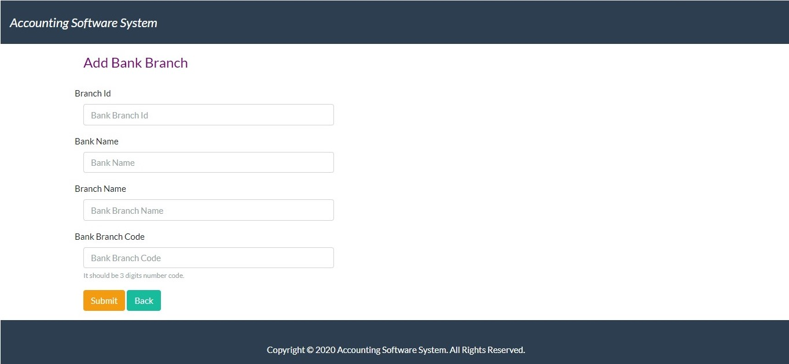

# Accounting Software System
 
 This is a simple CRUD application implemented using Codeigniter framework, Mysql database, Bootstrap.
 
 This Accounting software system is requested to add Bank-Branch add/edit/delete features for their next release & that impletation going as follow.   
 
 User can add/edit/delete their Bank-Branch details through a provided web interface and Bank-Branch details are stored in the MYsql database.
 
 > Bank-Branch List shown UI
 

 User can add new Bank-Branch details.
 
 > Add Bank-Branch UI
 
 
 
 That added details link to the Bank-Branch list and it show as below.
 
 > UI After Added New Bank-Branch
 
 
 
 User can edit/update Bank-Branch details.
 
 > Edit Bank-Branch UI
 
 
 
 That edited details link to the Bank-Branch list and it show as below. (You can see Branch Id 1, Sampath Bank Kiribathgoda branch updated as Galle branch)
 
 > UI After edit Bank-Branch
 
 
 
 User can delete Bank-Branch details by clicking the "Delete" button.
 
 > Delete Bank-Branch UI
 